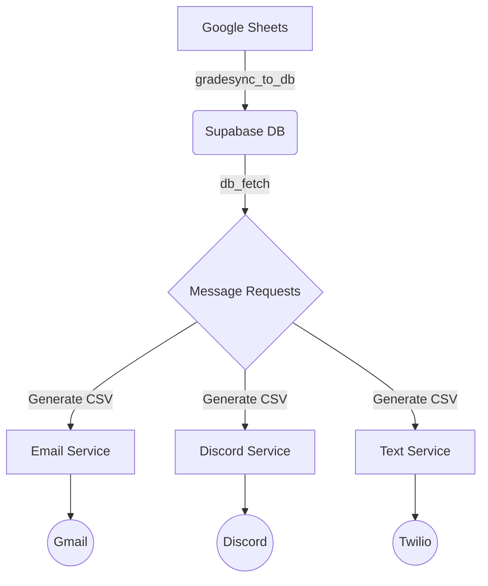

# AutoRemind System Overview

AutoRemind is a modular notification system designed to send automated reminders to students about coursework. It integrates with Grade Sources (like Google Sheets), a Database (Supabase), and multiple Notification Channels (Email, Discord, SMS).

## Architecture

The system is organized into a `services/` directory containing independent microservices that share a common configuration.



## Services

| Service | Directory | Description |
|---------|---------|-------------|
| self | `services/gradesync_input` | Ingests data, calculates deadlines, generates message queues. |
| **Email** | `services/email-service` | Sends rich HTML emails via Gmail API. |
| **Discord** | `services/discord_service` | Sends DMs via Discord Bot. |
| **Text** | `services/text-service` | Sends SMS via Twilio. |

## Shared Configuration

All services use a unified configuration system located in `services/shared/settings.py`.
This module loads environment variables from a single `.env.local` file in the project root.

### Key Environment Variables

| Variable | Service | Description |
|----------|---------|-------------|
| `SUPABASE_URL` | GradeSync | URL of the Supabase project. |
| `SUPABASE_SERVICE_ROLE_KEY` | GradeSync | Admin key for database access. |
| `GOOGLE_APPLICATION_CREDENTIALS` | Email/Sheets | Path to Service Account JSON. |
| `GMAIL_SENDER_EMAIL` | Email | Email address to impersonate. |
| `DISCORD_BOT_TOKEN` | Discord | Bot token. |
| `TWILIO_ACCOUNT_SID` | Text | Twilio Account SID. |

## Directory Structure

- **`public/`**: Frontend assets (landing page, login).
- **`src/`**: Backend API (Node.js) for the web interface.
- **`services/`**: Python microservices for backend processing.
- **`docs/`**: Documentation (you are here).

## Quick Start

1.  **Install Python Dependencies**:
    ```bash
    pip install -r services/requirements.txt
    ```

2.  **Configure**:
    Copy `.env.example` to `.env.local` and fill in the values.

3.  **Run Pipeline**:
    ```bash
    # 1. Sync Data
    python3 services/gradesync_input/gradesync_to_db.py
    
    # 2. Generate Requests
    python3 services/gradesync_input/db_fetch.py
    
    # 3. Send Emails
    python3 services/email-service/main.py
    ```
